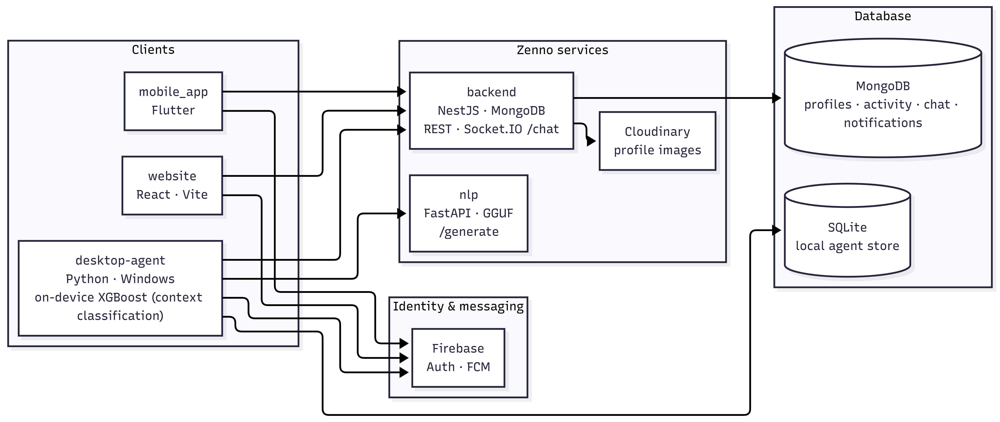

# Zenno

Zenno is a developer productivity and wellbeing platform that turns daily coding activity into meaningful insights, progress signals, and supportive nudges.

## Our Mission

We built Zenno to help developers improve focus, reduce burnout risk, and make consistent progress by understanding how work actually happens across tools, projects, and habits.

## What Zenno Does

Zenno combines local activity intelligence with cloud analytics and AI assistance to provide:

- Clear visibility into where time goes (apps, projects, languages, and contexts).
- Personal productivity trends over time.
- Context-aware nudges for healthier and more focused work sessions.
- Social and collaboration surfaces (profiles, peers, and chat).

## Core Product Features

- **Developer Analytics Dashboard**
  - Performance and behavior metrics.
  - Tool usage and language distribution.
  - Project and skills insights.

- **Context Intelligence**
  - Classifies work states like Flow, Debugging, Research, Communication, and Distracted.
  - Combines heuristic and ML-assisted signals.

- **Zenno Agent Nudges**
  - Personalized nudges based on recent activity and wellbeing context.
  - Resilient generation pipeline with fallback behavior.

- **Profile and Community**
  - Public profile experience.
  - Peer discovery and engagement.
  - Direct chat and notifications.

- **Operator Admin (Web)**
  - Website **`/admin`** for aggregate stats, user directory, and chat report moderation (`isAdmin` in MongoDB and Firebase session).

- **Cross-Platform Experience**
  - Web app.
  - Mobile app.
  - Desktop agent runtime.

## What We Built

Zenno is delivered as a multi-repository platform:

- `website` — React + Vite frontend for landing pages and the product experience.
- `mobile_app` — Flutter mobile app for analytics, profile, chat, and notifications.
- `desktop-agent` — Local Windows agent for activity capture, context detection (including on-device ML), and nudge orchestration.
- `backend` — NestJS API for auth-protected data, analytics endpoints, chat, notifications, preferences, and **`/api/v1/admin`** for operators.
- `nlp` — FastAPI-based nudge generation service with local GGUF model runtime and training pipeline.
- `.github` — Organization-level docs and standards.

## Tech Stack and Tools

### Frontend (Web)

- React 18 + TypeScript.
- Vite build tooling.
- Zustand (state management).
- Axios (API client).
- React Router.
- Socket.IO client.
- Firebase Web SDK (authentication and web messaging integration).

### Mobile App

- Flutter + Dart.
- Riverpod (state management and dependency injection).
- GoRouter (navigation).
- Dio (network layer).
- Firebase Core, Auth, and Messaging.
- flutter_local_notifications (local notification presentation).
- Socket.IO client.

### Backend API

- NestJS 11 + TypeScript.
- MongoDB (primary cloud database).
- Mongoose ODM (`@nestjs/mongoose`).
- Firebase Admin SDK (ID token verification).
- Socket.IO gateway (`@nestjs/websockets`).
- Swagger and OpenAPI (`@nestjs/swagger`).
- Scheduled and cron jobs (`@nestjs/schedule`).
- Cloudinary integration (profile image uploads).

### Desktop Agent Runtime

- Python.
- SQLite (local-first data store on the user machine).
- pywebview (desktop authentication UI).
- requests and keyring (API access and token persistence).
- scikit-learn and XGBoost (on-device context classification).
- pandas, NumPy, and joblib (data processing and model utilities).

### NLP / AI Service

- FastAPI and Uvicorn.
- Pydantic schemas.
- llama-cpp-python (GGUF inference).
- Qwen2.5-0.5B-Instruct GGUF model family.
- LoRA fine-tuning and merge/export pipeline.

### Authentication and Notifications

- **Authentication:** Firebase Authentication across web, mobile, and desktop flows.
- **Push notifications (Web):** Firebase Cloud Messaging and a service worker.
- **Push notifications (Mobile):** Firebase Messaging and local notification rendering.
- **In-app notifications:** Backend-managed notification APIs, unread state, and preferences.

### Infrastructure, DevOps, and Tooling

- Git and GitHub (multi-repository platform).
- GitHub Actions (CI and CD pipelines).
- Docker and Docker Compose.
- AWS EC2 deployment target (current backend and NLP deployment setup).
- npm and Node.js tooling.
- Python virtual environments and pip.
- Flutter toolchain.

## How Zenno Works (At a Glance)

1. The desktop agent captures local activity and behavioral signals.
2. The backend API stores, aggregates, and serves analytics data.
3. The NLP service generates nudge text with fallback safety.
4. The website and mobile app present insights, settings, and collaboration flows.
5. Notifications and chat keep users engaged across sessions.

### Platform Architecture

## Current Deployment Endpoints

**Project status:** Zenno is a **student project**. It is deployed on **AWS EC2** using **free or promotional credits**. **URLs below are not always live:** instances may be stopped to save credits, or endpoints may be unavailable when credits run out.

When the deployment is up, services are typically reachable at:

- **Website:** [https://zenno.dev](https://zenno.dev)
- **Admin Console** (operators; same app; requires `isAdmin` in MongoDB): [https://zenno.dev/admin](https://zenno.dev/admin)
- **Backend API docs:** [https://api.zenno.dev/api/docs](https://api.zenno.dev/api/docs)
- **NLP API docs:** [https://nlp.zenno.dev/docs](https://nlp.zenno.dev/docs)

## Repository Documentation

Each repository contains its own detailed technical README with:

- Setup and run instructions.
- Environment variables and secrets guidance.
- Architecture and module-level details.
- CI/CD and deployment specifics (where applicable).

If you want to contribute or deploy a specific component, start with that repository’s README.

---

Last Updated: 2026-05-15
